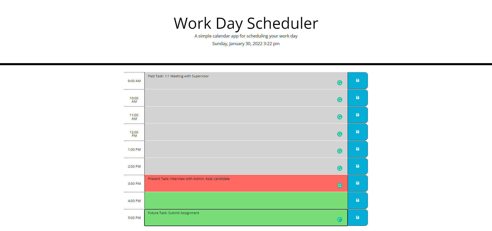

# :calendar: :memo:Third Party APIs Work Day Scheduler Challenge :memo: :calendar:

## Overview :book:
For this challenge I was assigned to refactor a work day schedule.  Utilizing a Third Party Application Programming Interface (API), which features HTML & CSS powered by jQuery.


### User Story :notebook_with_decorative_cover:
```
AS AN employee with a busy schedule
I WANT to add important events to a daily planner
SO THAT I can manage my time effectively
```

### Client's Acceptance Criteria :pencil2:
```
GIVEN I am using a daily planner to create a schedule
WHEN I open the planner
THEN the current day is displayed at the top of the calendar
WHEN I scroll down
THEN I am presented with time blocks for standard business hours
WHEN I view the time blocks for that day
THEN each time block is color-coded to indicate whether it is in the past, present, or future
WHEN I click into a time block
THEN I can enter an event
WHEN I click the save button for that time block
THEN the text for that event is saved in local storage
WHEN I refresh the page
THEN the saved events persist
```

---
## Features

* Dynamically updated HTML
* CSS
* jQuery
* Local storage
* Third Party API
* DOM


---

## :link: Link to Webpage

Click the following link to visit the webpage:

[A live link to the webpage](https://adorsey5.github.io/work-day-scheduler/)


The following image is a screenshot of the webpage:



---
## :capital_abcd:Languages and Technology Used :computer:

### Languages
* HTML
* CSS
* jQuery


### Technology

* VSCode
* GitBash
* Emojis from "Markdown Emoji" VSCode extension *

---

## Acknowledgments

For my fourth challenge I had a great deal of guidance from:

 * UM Coding Bootcamp Modules/GitLab Respository
 * UM Coding Bootcamp instructor and teacher assistants (TAs)
 * UM Coding Bootcamp Tutor: Jeremy Jones
 * UM Coding Bootcamp Classmates
 * GitHub
 * Google


 ---

- - -
© 2022 Asha Dorsey
